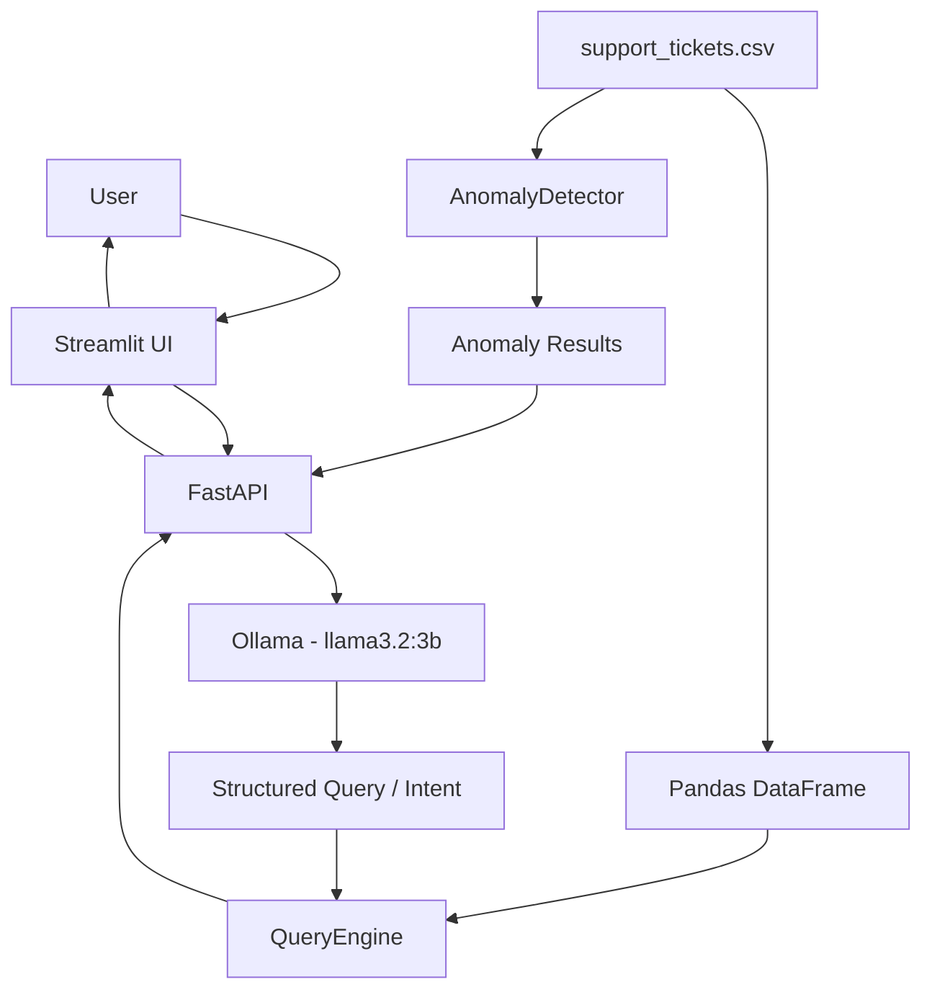

# AI Support Ticket Intelligence

## Problem statement
Support teams need quick, reliable answers about ticket volume, ownership, resolution performance, and operational risk. This project provides a natural-language interface over a support-ticket CSV while keeping the calculations deterministic and inspectable.

## What the application does
- Loads and validates support-ticket data.
- Accepts natural-language questions through a Streamlit UI and FastAPI endpoint.
- Uses Ollama to map a question to a small, validated structured query.
- Executes that query with pandas in `QueryEngine`.
- Detects long-resolution and aging high-priority unresolved tickets.
- Returns a human-readable answer plus the structured result.

## Dataset
The dataset contains 500 support tickets with these fields:
`ticket_id`, `created_at`, `category`, `priority`, `status`, `response_time_hrs`, `resolution_time_hrs`, `agent_id`, `customer_rating`, and `issue_summary`.

`data/support_tickets.csv` is the application input. The root `support_tickets.csv` is retained as the supplied source copy. Neither file should be modified by the application.

## Architecture



This project has two main flows.

1. Query flow: the user asks a natural-language question in the Streamlit UI. Streamlit collects the question, sends it to FastAPI, and displays the final answer and result. FastAPI receives the request, calls Ollama with the requested model (`llama3.2:3b`), and asks the LLM to convert the question into a strict structured query or intent. That structured intent is then passed to `QueryEngine`, which applies deterministic filtering and aggregation logic with pandas against `support_tickets.csv`. The CSV is the data source of truth; the LLM does not directly calculate the result.

2. Anomaly flow: `support_tickets.csv` is also loaded and analyzed by `AnomalyDetector`. The detector identifies long-resolution tickets and high-priority unresolved tickets that are aging beyond the configured thresholds. Those anomaly records are returned through FastAPI and rendered in the Streamlit UI.

- `Streamlit` is the browser-facing interface. It presents the app, captures user questions, and displays answers and anomaly results.
- `FastAPI` is the backend orchestrator. It routes requests, validates and normalizes payloads, calls the LLM or analytics layers, and returns structured JSON responses to the UI.
- `Ollama` is used to interpret natural language and emit a constrained schema for the supported query intent. It is not the calculator; it is the language-to-structure adapter.
- `QueryEngine` contains the deterministic ticket logic. It runs counts, averages, groupings, and status/priority filters against the data loaded by pandas.
- The LLM does not directly calculate answers because the system must remain reliable, testable, and auditable. The LLM only produces a structured intent; the actual calculations happen in the code layer using pandas and the CSV data.
- `AnomalyDetector` performs explainable anomaly checking, such as long resolution times and aging high-priority unresolved tickets, using statistical thresholds and ticket age rules.
- The CSV is used as the authoritative source of support ticket records. It is loaded into memory with pandas, queried by `QueryEngine`, and scanned by `AnomalyDetector` for operational risk signals.

## Technology stack
- Python 3.13+
- FastAPI and Uvicorn for the API
- Streamlit for the browser UI
- Ollama for intent and filter extraction
- Pydantic for request and LLM-output validation
- pandas for data loading and deterministic analytics
- pytest for automated tests

## Prerequisite: Ollama
Ollama must be installed on the evaluator's machine before running the application. The required model is `llama3.2:3b`.

After installing Ollama on Windows, open PowerShell and run:

```powershell
ollama pull llama3.2:3b
```

Ensure Ollama is running locally at `http://localhost:11434`. If needed, start it with:

```powershell
ollama serve
```

The natural-language `POST /query` functionality requires Ollama. The deterministic ticket analytics and anomaly detection functionality is implemented in Python and pandas.

## Data loading
`app/data_loader.py` reads the canonical CSV from `data/support_tickets.csv`, enforces the expected column set, parses `created_at` with the expected format, converts numeric fields, and validates required values, non-negative metrics, allowed categories, priorities, and statuses. A custom path can be supplied when constructing `QueryEngine` or `AnomalyDetector` in Python.

## Natural-language query flow
1. Streamlit sends the question to `POST /query`.
2. `OllamaService` sends Ollama a strict prompt and JSON schema.
3. The response is extracted, normalized, and validated as `StructuredTicketQuery`.
4. `TicketQueryInterpreter` maps the supported intent to a `QueryEngine` method.
5. `QueryEngine` filters the loaded DataFrame and calculates the result.
6. The API serializes pandas values safely and returns both `answer` and `result`.

The LLM does not directly calculate results. It is used only as a language-to-structure adapter. Keeping calculations in `QueryEngine` prevents hallucinated counts and makes answers reproducible, testable, and auditable against the CSV.

## QueryEngine design
`QueryEngine` owns equality and multi-value filtering and provides deterministic methods for counts, averages, groupings, unresolved tickets, high/critical unresolved tickets, long resolutions, and the agent with the most resolved tickets. The API and interpreter call this layer instead of embedding pandas logic in request handlers.

## Anomaly detection
`AnomalyDetector` reports two explainable anomaly types:

- **Long resolution:** a non-null `resolution_time_hrs` greater than the IQR upper fence.
- **High-priority unresolved:** a `High` or `Critical` ticket with status `Open` or `Escalated` whose age exceeds 24 hours at the supplied reference time. If no reference time is supplied, the current local-naive timestamp is used.

For resolution times, the detector calculates:

- `Q1`: 25th percentile
- `Q3`: 75th percentile
- `IQR = Q3 - Q1`
- `upper fence = Q3 + 1.5 * IQR`

Tickets above, rather than equal to, the upper fence are flagged. Duplicate ticket rows are de-duplicated within each anomaly rule. With reference time `2024-04-01T00:00:00`, the supplied dataset produces 21 long-resolution anomalies, 80 high-priority unresolved anomalies, and 101 total anomaly records.

## API endpoints
- `GET /health` returns `{"status":"ok"}`.
- `POST /query` accepts `{"question":"..."}` and returns the question, answer, and structured result.
- `GET /anomalies` returns all anomaly records. Optional `reference_time` makes aging checks reproducible.
- `GET /docs` serves the interactive Swagger UI.
- `GET /openapi.json` serves the generated OpenAPI schema.

## Streamlit UI
The UI shows overview metrics, a natural-language question form, example questions, API errors, and anomaly results. It communicates with FastAPI using `API_BASE_URL`; it does not load or calculate ticket results independently.

## Installation

```powershell
python -m venv .venv
.\.venv\Scripts\Activate.ps1
python -m pip install --upgrade pip
python -m pip install -r requirements.txt
```

The dependency file pins the tested application versions and keeps `pandas` at `>=2.0,<3` because the project tests rely on pandas datetime behavior.

Copy `.env.example` to `.env` and configure `OLLAMA_MODEL`, `OLLAMA_BASE_URL`, and `API_BASE_URL`. The application reads these values from the process environment; load the `.env` values in your shell before starting the services.

## Run

### Run FastAPI
From the project root:

```powershell
.\.venv\Scripts\Activate.ps1
python -m uvicorn app.main:app --reload
```

The API is available at `http://localhost:8000`.

### Run Streamlit
In a second terminal:

```powershell
.\.venv\Scripts\Activate.ps1
python -m streamlit run ui\streamlit_app.py
```

The UI is available at `http://localhost:8501`.

## Run tests

```powershell
python -m pytest -q
```

The final Stage 8 run passed 43 tests. The suite covers data validation/loading, deterministic queries, anomaly rules, LLM normalization and failures, and API error mapping.

## Example questions and outputs
Using the supplied 500-row dataset:

| Question | Result |
| --- | ---: |
| How many tickets are open? | 111 |
| How many Critical tickets are unresolved? | 31 |
| What is the average resolution time for Technical tickets? | 20.59 hours |
| Which category has the most tickets? | General, 189 tickets |
| Which agent resolved the most tickets? | AGT-09 |
| How many Escalated tickets are there? | 62 |

## Error handling
- Empty or whitespace-only questions are rejected with HTTP 422.
- Unsupported intents are reported as an unsupported question with HTTP 422.
- Invalid Ollama JSON or schema output is reported with HTTP 502.
- Ollama connection failures and Ollama-reported errors are reported with HTTP 503.
- Unsupported filters are rejected during structured-query validation and returned as an API error.
- Unexpected query or anomaly failures return a generic HTTP 500 response without exposing internals.
- Streamlit displays actionable messages for API and Ollama connectivity failures.

## Assumptions
- Ticket timestamps use `YYYY-MM-DD HH:MM` and are interpreted as timezone-naive values.
- `Open` and `Escalated` are the unresolved statuses.
- High-priority means exactly `High` or `Critical`.
- An aging anomaly is strictly older than 24 hours.
- The configured Ollama model supports structured JSON output.

## Limitations
- Ollama must be installed, running, and supplied with the configured model for live natural-language queries.
- The supported intent and filter vocabulary is intentionally limited.
- There is no authentication, persistence layer, or multi-user state management.
- Anomaly results depend on the reference time when one is not explicitly supplied.
- The supplied CSV is loaded into memory and is not designed for very large datasets.

## Future improvements
- Add authentication and request rate limiting.
- Add a production configuration and container deployment.
- Add richer time-window and trend analysis.
- Add a background data refresh and a larger analytical storage layer.
- Add evaluation metrics for LLM intent classification across a curated question set.
